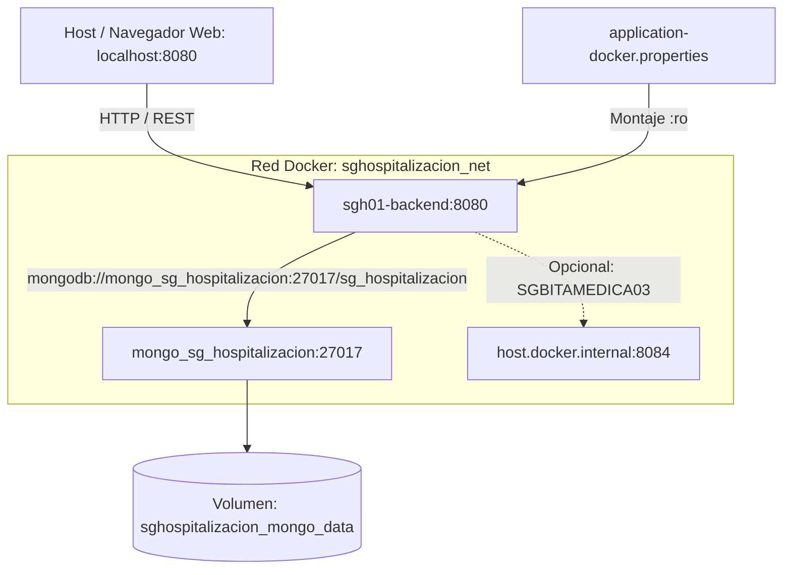

# Guía de Dockerización y Despliegue con Docker Compose — SGHospitalizacion01 (Backend)

Esta guía explica, de forma práctica, exhaustiva y estructurada, cómo ejecutar el backend clínico **SGHospitalizacion01** (Spring Boot 4 / Java 21) en Docker y conectarlo al motor de base de datos **MongoDB** que corre en su propio contenedor dedicado, garantizando cero intervención tras reinicios y persistencia total de la información clínica.

---

## Índice
1. [Qué resuelve esta guía](#1-qué-resuelve-esta-guía)
2. [Arquitectura de Contenedores y Red](#2-arquitectura-de-contenedores-y-red)
3. [Archivos del proyecto usados en la dockerización](#3-archivos-del-proyecto-usados-en-la-dockerización)
4. [Despliegue Paso a Paso](#4-despliegue-paso-a-paso)
5. [Ciclo Completo: Escritura del Dockerfile, Build de Imagen y Commit Local](#5-ciclo-completo-escritura-del-dockerfile-build-de-imagen-y-commit-local)
6. [Flujo de configuración](#6-flujo-de-configuración)
7. [Verificación y diagnóstico rápido](#7-verificación-y-diagnóstico-rápido)
8. [Operaciones de día a día (Ciclo de vida)](#8-operaciones-de-día-a-día-ciclo-de-vida)
9. [Solución de problemas comunes](#9-solución-de-problemas-comunes)
10. [Buenas prácticas y notas de seguridad](#10-buenas-prácticas-y-notas-de-seguridad)

---

## 1. Qué resuelve esta guía
* **Aislamiento completo**: Ejecutar el backend en `0.0.0.0:8080` dentro de Docker y publicarlo en el puerto `8080` del host.
* **Separación de infraestructura**: Mantener el motor MongoDB en un contenedor dedicado e independiente (`mongo_sg_hospitalizacion`), permitiendo reiniciar el backend sin afectar los datos ni la base de datos.
* **Configuración desacoplada**: Montar el archivo `application-docker.properties` desde el host en tiempo de ejecución, evitando tener que reconstruir la imagen para cambiar credenciales, secretos o URLs externas.
* **Red compartida unificada**: Conectar el backend a una red bridge fija (`sghospitalizacion_net`), permitiendo la comunicación fluida con MongoDB y con el frontend `SGHospitalizacion02`.

---

## 2. Arquitectura de Contenedores y Red



* **Contenedor de la Aplicación (`sgh01-backend`)**:
  * Construido con `Dockerfile` multi-stage (Fase 1: compila con Eclipse Temurin JDK 21; Fase 2: runtime ligero JRE 21).
  * Escucha en `0.0.0.0:8080` y se publica en el puerto `8080` del host.
  * Carga configuración adicional en frío desde `/app/config/application.properties`.
* **Contenedor del Motor MongoDB (`mongo_sg_hospitalizacion`)**:
  * Levanta la imagen oficial `mongo:7.0`.
  * Se gestiona en su propio Compose (`docker_compose_mongo.yml`) para asegurar independencia del ciclo de vida.
  * Los datos se almacenan en el volumen `sghospitalizacion_mongo_data`.
  * El backend accede a MongoDB mediante el hostname interno: `mongo_sg_hospitalizacion:27017`.
* **Red (`sghospitalizacion_net`)**:
  * Red bridge fija que provee resolución DNS automática entre contenedores.

---

## 3. Archivos del proyecto usados en la dockerización

* **Dockerfile**: Multi-stage build con JDK 21 y JRE 21. Variables: `SPRING_CONFIG_ADDITIONAL_LOCATION`, `SERVER_ADDRESS=0.0.0.0`, `SERVER_PORT=8080`.
* **docker_compose_mongo.yml**: Compose dedicado al motor MongoDB y volumen persistente.
* **docker_compose_sghospitalizacion01.yml**: Servicio `app` con build, montaje de properties `:ro` y enlace a `sghospitalizacion_net`.
* **src/main/resources/application-docker.properties**: Configuración para runtime en contenedor.
* **.env.example**: Diccionario de variables de entorno recomendadas.
* **DockerComposeAutomation.sh**: Script automatizado para Linux/macOS.
* **DockerEnvironmentSetup.ps1**: Script automatizado para Windows PowerShell.

---

## 4. Despliegue Paso a Paso

Sigue esta secuencia ordenada para poner en marcha el stack del backend de forma limpia y confiable.

### Paso 1: Requisitos previos y verificación de puertos
Antes de iniciar, confirma que Docker y Docker Compose (v2) estén activos y que los puertos necesarios estén libres en tu máquina anfitriona:
```bash
# 1. Verificar servicio de Docker
docker info >/dev/null 2>&1 && echo "Docker está activo" || echo "Error: Inicia Docker Desktop / Daemon"

# 2. Verificar que los puertos 8080 y 27017 no estén tomados por otros servicios locales
lsof -i :8080 -i :27017 || echo "Puertos 8080 y 27017 disponibles"
```

### Paso 2: Crear la red compartida y levantar MongoDB dedicado
El motor MongoDB corre en su propio contenedor desacoplado para asegurar que los datos persistan independientemente del ciclo de vida del backend:
```bash
# 1. Crear la red Docker si no existe aún
docker network create sghospitalizacion_net 2>/dev/null || true

# 2. Levantar el contenedor del motor MongoDB con su volumen persistente
docker compose -f docker_compose_mongo.yml up -d

# 3. Validar que el motor esté en ejecución saludable
docker ps --filter "name=mongo_sg_hospitalizacion"
```

### Paso 3: Configurar variables y properties de entorno
1. Copia la plantilla de variables de entorno si deseas personalizar puertos o memoria:
   ```bash
   cp .env.example .env
   ```
2. Revisa que `src/main/resources/application-docker.properties` apunte correctamente al hostname del contenedor MongoDB (`mongo_sg_hospitalizacion`):
   ```properties
   spring.mongodb.uri=mongodb://mongo_sg_hospitalizacion:27017/sg_hospitalizacion
   spring.data.mongodb.uri=mongodb://mongo_sg_hospitalizacion:27017/sg_hospitalizacion
   server.address=0.0.0.0
   server.port=8080
   JWT_SECRET=MDEyMzQ1Njc4OTAxMjM0NTY3ODkwMTIzNDU2Nzg5MDE=
   ```

### Paso 4: Ejecución del despliegue del Backend
Puedes optar por la automatización con script o por el comando nativo de Docker Compose:

#### Opción A: Script Automatizado para Linux / macOS
```bash
chmod +x DockerComposeAutomation.sh
./DockerComposeAutomation.sh
```

#### Opción B: Script Automatizado para Windows PowerShell
```powershell
powershell -ExecutionPolicy Bypass -File .\DockerEnvironmentSetup.ps1
```

#### Opción C: Despliegue Manual con Docker Compose CLI
```bash
# 1. Construir la imagen multi-stage (descarga dependencias Maven y compila el JAR)
docker compose -f docker_compose_sghospitalizacion01.yml build

# 2. Iniciar el contenedor en segundo plano eliminando posibles huérfanos
docker compose -f docker_compose_sghospitalizacion01.yml up -d --remove-orphans
```

### Paso 5: Monitoreo y validación de inicio
Revisa la salida de inicialización de Spring Boot en tiempo real:
```bash
docker compose -f docker_compose_sghospitalizacion01.yml logs -f app
```
*Espera a observar la confirmación:*
```
Tomcat started on port 8080 (http) with context path '/'
Started SgHospitalizacion01Application in X.XXX seconds
```
Presiona `Ctrl + C` para salir de la visualización de logs (el contenedor continuará ejecutándose en segundo plano).

---

## 5. Ciclo Completo: Escritura del Dockerfile, Build de Imagen y Commit Local

Esta sección documenta el proceso íntegro desde la escritura del `Dockerfile` hasta el commit en la rama personal, para que puedas reproducirlo en cualquier proyecto Spring Boot.

### 5.1 Escritura del Dockerfile (Multi-Stage Build)

El `Dockerfile` se ubica en la raíz del proyecto. Utiliza un patrón de dos etapas:

**Contenido completo del `Dockerfile`:**
```dockerfile
# syntax=docker/dockerfile:1

# ═══════════════════════════════════════════════════════════════
# ETAPA 1: BUILD — Compilación con JDK 21
# ═══════════════════════════════════════════════════════════════
FROM eclipse-temurin:21-jdk AS build
WORKDIR /app

# 1. Copiar archivos del wrapper Maven y pom.xml primero (cacheo de dependencias)
COPY .mvn/ .mvn/
COPY mvnw pom.xml ./
RUN chmod +x mvnw

# 2. Descargar dependencias offline (aprovecha caché de Docker si pom.xml no cambia)
RUN ./mvnw -q -B -e -DskipTests dependency:go-offline || true

# 3. Copiar código fuente y empaquetar
COPY src ./src
RUN ./mvnw -q -B -DskipTests package

# ═══════════════════════════════════════════════════════════════
# ETAPA 2: RUNTIME — Imagen ligera solo con JRE 21
# ═══════════════════════════════════════════════════════════════
FROM eclipse-temurin:21-jre
ENV JAVA_OPTS="-Xms256m -Xmx512m"
ENV TZ=${TZ:-UTC}
WORKDIR /app

# Copiar SOLO el JAR compilado de la etapa anterior
COPY --from=build /app/target/*.jar app.jar

# Punto de montaje para configuración externa (properties inyectadas en runtime)
ENV SPRING_CONFIG_ADDITIONAL_LOCATION="optional:file:/app/config/"
ENV SPRING_CONFIG_IMPORT="optional:file:/app/config/application.properties"

# Bind en todas las interfaces (obligatorio dentro de Docker)
ENV SERVER_ADDRESS=0.0.0.0
ENV SERVER_PORT=8080
EXPOSE ${SERVER_PORT}

ENTRYPOINT ["sh","-c","java $JAVA_OPTS -Dserver.address=${SERVER_ADDRESS} -Dserver.port=${SERVER_PORT} -Duser.timezone=${TZ} -Dspring.config.additional-location=${SPRING_CONFIG_ADDITIONAL_LOCATION} -Dspring.config.import=${SPRING_CONFIG_IMPORT} -jar app.jar"]
```

**Explicación de cada bloque:**

| Línea / Bloque | Propósito |
| :--- | :--- |
| `FROM eclipse-temurin:21-jdk AS build` | Imagen pesada con JDK 21 para compilación. Se descarta al final. |
| `COPY .mvn/ + mvnw + pom.xml` | Copiar primero las definiciones Maven para cachear dependencias. Si `pom.xml` no cambia, Docker reutiliza la capa. |
| `dependency:go-offline` | Descarga todas las dependencias sin compilar. Acelera rebuilds. |
| `COPY src → package` | Copiar fuentes y generar el `.jar` ejecutable. |
| `FROM eclipse-temurin:21-jre` | Imagen ligera (~250MB vs ~800MB del JDK). Solo runtime. |
| `COPY --from=build` | Trae el JAR de la primera etapa. Seguridad: el código fuente NO queda en la imagen. |
| `SPRING_CONFIG_ADDITIONAL_LOCATION` | Spring Boot busca properties en `/app/config/`. Se monta con Docker Compose. |
| `SERVER_ADDRESS=0.0.0.0` | Acepta conexiones desde fuera del contenedor. Sin esto, Spring escucha solo en `127.0.0.1` (inaccesible). |
| `ENTRYPOINT` | Lanza la JVM con las variables de entorno configuradas. |

### 5.2 Build de la Imagen Docker

Una vez creado el `Dockerfile`, construye la imagen localmente:

```bash
# Desde la raíz del proyecto SGHospitalizacion01/

# Opción 1: Build con Docker Compose (recomendado, usa la definición del compose)
docker compose -f docker_compose_sghospitalizacion01.yml build

# Opción 2: Build directo con Docker CLI (sin compose)
docker build -t sghospitalizacion01-app:latest .
```

**Verificar que la imagen fue creada:**
```bash
docker images | grep sghospitalizacion01
```
Salida esperada:
```
sghospitalizacion01-app   latest   abc123def456   10 seconds ago   285MB
```

**Rebuild tras cambios en el código:**
```bash
# Sin caché (reconstruye todo desde cero)
docker compose -f docker_compose_sghospitalizacion01.yml build --no-cache

# Con caché (solo recompila las capas modificadas — mucho más rápido)
docker compose -f docker_compose_sghospitalizacion01.yml build
```

### 5.3 Verificar el Contenedor en Ejecución

```bash
# Levantar el contenedor
docker compose -f docker_compose_sghospitalizacion01.yml up -d --remove-orphans

# Verificar estado
docker ps --filter "name=sgh01-backend"

# Validar respuesta HTTP
curl -I http://localhost:8080/swagger-ui/index.html
# Esperado: HTTP/1.1 200 OK
```

### 5.4 Commit Local en la Rama Personal

Una vez verificado que todo funciona, realiza el commit en tu rama personal:

```bash
# 1. Verificar en qué rama te encuentras
git branch --show-current
# Esperado: aagrandaz-01 (o tu rama personal)

# 2. Si NO estás en tu rama personal, créala y cámbiate:
git checkout -b aagrandaz-01

# 3. Ver los archivos modificados/nuevos
git status

# 4. Agregar los archivos de dockerización al staging
git add Dockerfile
git add docker_compose_mongo.yml
git add docker_compose_sghospitalizacion01.yml
git add src/main/resources/application-docker.properties
git add .env.example
git add DockerComposeAutomation.sh
git add DockerEnvironmentSetup.ps1
git add README-DOCKER-COMPOSE.md
git add .gitignore

# 5. Realizar el commit con mensaje descriptivo (Conventional Commits)
git commit -m "feat(docker): agregar motor Mongo dedicado, containerización del backend y guía de despliegue paso a paso"

# 6. Verificar que el commit se registró correctamente
git log -n 1 --oneline
# Salida esperada: abc1234 feat(docker): agregar motor Mongo dedicado, containerización del backend y guía de despliegue paso a paso

# 7. Verificar que el árbol de trabajo quedó limpio
git status
# Esperado: nothing to commit, working tree clean
```

**Convenciones de commit utilizadas:**
- `feat(docker):` → Indica una nueva funcionalidad en el ámbito de Docker.
- Mensaje en español, imperativo, describiendo el cambio completo.
- No se incluyen archivos de caché, binarios ni `.env` con secretos reales.

---

## 6. Flujo de configuración

1. El `Dockerfile` define:
   ```dockerfile
   ENV SPRING_CONFIG_ADDITIONAL_LOCATION="optional:file:/app/config/"
   ENV SPRING_CONFIG_IMPORT="optional:file:/app/config/application.properties"
   ```
2. El archivo Compose monta `./src/main/resources/application-docker.properties` en `/app/config/application.properties:ro`.
3. Spring Boot lee dicho archivo con máxima prioridad sobre cualquier propiedad empaquetada.
4. Parámetros clave dentro de `application-docker.properties`:
   ```properties
   spring.application.name=SGHospitalizacion
   spring.mongodb.uri=mongodb://${MONGO_HOST:mongo_sg_hospitalizacion}:${MONGO_PORT:27017}/${MONGO_DB:sg_hospitalizacion}
   spring.data.mongodb.uri=mongodb://${MONGO_HOST:mongo_sg_hospitalizacion}:${MONGO_PORT:27017}/${MONGO_DB:sg_hospitalizacion}
   server.address=0.0.0.0
   server.port=8080
   JWT_SECRET=MDEyMzQ1Njc4OTAxMjM0NTY3ODkwMTIzNDU2Nzg5MDE=
   sgbitamedica.base-url=${SGBITAMEDICA_URL:http://host.docker.internal:8084}
   ```

---

## 7. Verificación y diagnóstico rápido

1. **Revisar estado de contenedores**:
   ```bash
   docker compose -f docker_compose_sghospitalizacion01.yml ps
   ```
2. **Acceso a la interfaz Swagger / OpenAPI**:
   * URL: [http://localhost:8080/swagger-ui/index.html](http://localhost:8080/swagger-ui/index.html)
   * Debe cargar la documentación interactiva con los endpoints de Hospitalización, Historias Clínicas, Anamnesis, Exámenes Médicos y Camas.
3. **Prueba de conectividad HTTP vía terminal**:
   ```bash
   curl -I http://localhost:8080/swagger-ui/index.html
   ```
   *(Respuesta esperada: `HTTP/1.1 200 OK` o `302 Found`)*
4. **Verificar conexión a MongoDB en los logs**:
   ```bash
   docker logs sgh01-backend | grep -i "mongo"
   ```
   *(Debe mostrar `Monitor thread successfully connected to server`)*

---

## 8. Operaciones de día a día (Ciclo de vida)

* **Detener el backend**:
  ```bash
  docker compose -f docker_compose_sghospitalizacion01.yml stop
  ```
* **Reiniciar el backend**:
  ```bash
  docker compose -f docker_compose_sghospitalizacion01.yml restart app
  ```
* **Bajar y remover el contenedor del backend**:
  ```bash
  docker compose -f docker_compose_sghospitalizacion01.yml down
  ```
* **Reconstruir la imagen tras cambios en el código Java**:
  ```bash
  docker compose -f docker_compose_sghospitalizacion01.yml build --no-cache
  docker compose -f docker_compose_sghospitalizacion01.yml up -d
  ```
* **Detener o reiniciar MongoDB**:
  ```bash
  docker compose -f docker_compose_mongo.yml stop
  docker compose -f docker_compose_mongo.yml start
  ```

---

## 9. Solución de problemas comunes

### 1. Error `MongoSocketOpenException` / Connection Refused
* **Causa**: El contenedor `mongo_sg_hospitalizacion` no está corriendo o no está en la red `sghospitalizacion_net`.
* **Solución**:
  ```bash
  docker compose -f docker_compose_mongo.yml up -d
  docker network connect sghospitalizacion_net mongo_sg_hospitalizacion 2>/dev/null || true
  ```

### 2. Error en arranque: Clave JWT inválida (`WeakKeyException` o `IllegalArgumentException`)
* **Causa**: La clave `JWT_SECRET` tiene menos de 256 bits (32 bytes) una vez decodificada de Base64.
* **Solución**: Asegúrate de que `JWT_SECRET` en `application-docker.properties` tenga una longitud Base64 válida mínima (por ejemplo: `MDEyMzQ1Njc4OTAxMjM0NTY3ODkwMTIzNDU2Nzg5MDE=`).

### 3. Puerto 8080 ocupado en el host
* **Diagnóstico**:
  ```bash
  lsof -i :8080
  ```
* **Solución**: Detener el proceso que use el puerto o cambiar el mapeo en `docker_compose_sghospitalizacion01.yml` a `"8085:8080"`.

---

## 10. Buenas prácticas y notas de seguridad

1. **Secretos**: No versionar claves reales de producción en repositorios públicos. Use variables de entorno en el host o un gestor de secretos.
2. **Volumen de Base de Datos**: El volumen `sghospitalizacion_mongo_data` preserva los registros médicos aunque se destruyan los contenedores.
3. **Memoria JVM**: `JAVA_OPTS` está configurado por defecto en `-Xms256m -Xmx512m` para un uso eficiente de recursos; puede incrementarse según la carga de trabajo en el archivo Compose.
